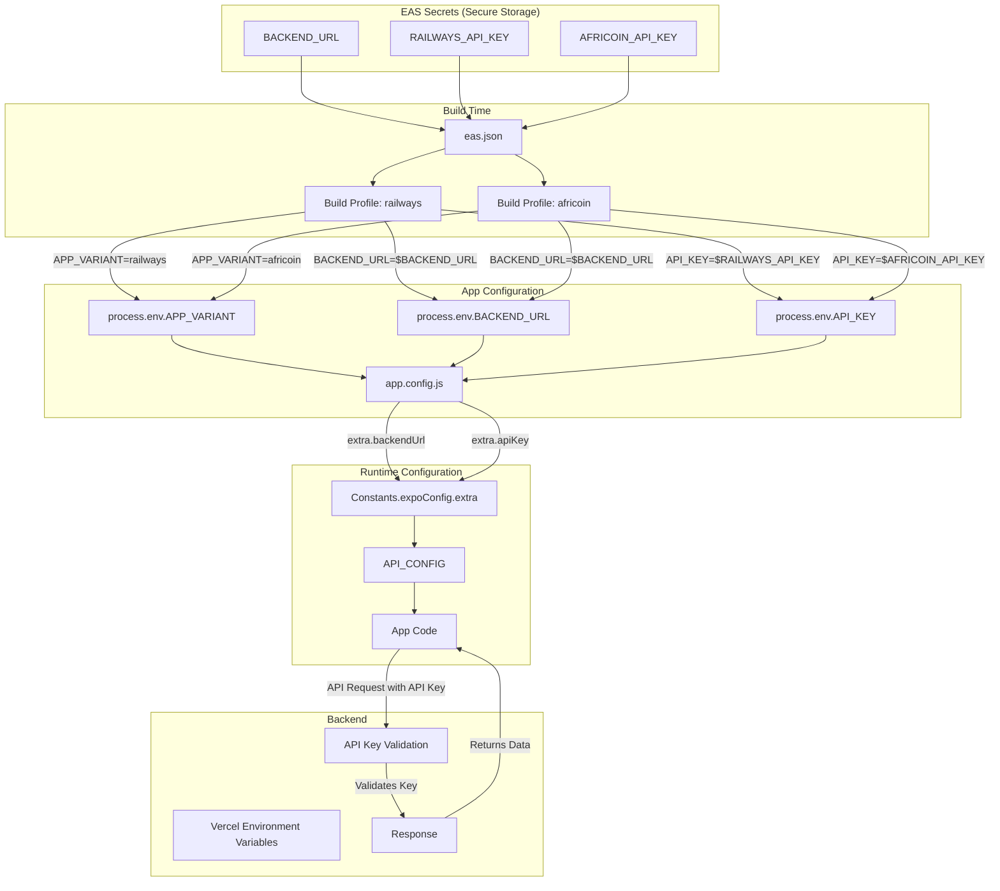
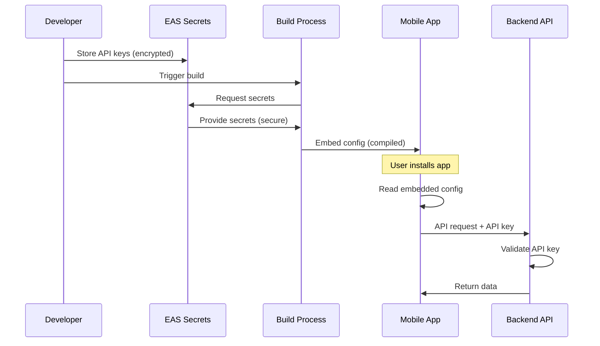

# 🔄 Configuration Flow Diagram

## How Environment Variables Flow Through the System



## Step-by-Step Flow

### 1. Developer Sets EAS Secrets

```bash
eas secret:create --scope project --name BACKEND_URL --value "https://africa-railways.vercel.app"
eas secret:create --scope project --name RAILWAYS_API_KEY --value "rw_secret123"
eas secret:create --scope project --name AFRICOIN_API_KEY --value "ac_secret456"
```

**Stored in:** EAS Secure Storage (encrypted)

---

### 2. Build Profile References Secrets

**File:** `eas.json`

```json
{
  "build": {
    "railways": {
      "env": {
        "APP_VARIANT": "railways",
        "BACKEND_URL": "$BACKEND_URL",        // ← References EAS secret
        "API_KEY": "$RAILWAYS_API_KEY"        // ← References EAS secret
      }
    }
  }
}
```

**What happens:** EAS CLI reads secrets and injects them as environment variables during build

---

### 3. App Config Reads Environment Variables

**File:** `app.config.js`

```javascript
const IS_RAILWAYS = process.env.APP_VARIANT === 'railways';

export default {
  expo: {
    name: IS_RAILWAYS ? "Africa Railways Hub" : "Africoin Wallet",
    extra: {
      backendUrl: process.env.BACKEND_URL,    // ← From build env
      apiKey: process.env.API_KEY             // ← From build env
    }
  }
};
```

**What happens:** Build-time environment variables are embedded into app configuration

---

### 4. Runtime Code Accesses Configuration

**File:** `src/config/api.js`

```javascript
import Constants from 'expo-constants';

const config = Constants.expoConfig?.extra || {};

export const API_CONFIG = {
  baseUrl: config.backendUrl,    // ← From app.config.js extra
  apiKey: config.apiKey,         // ← From app.config.js extra
};
```

**What happens:** App reads configuration at runtime from embedded config

---

### 5. App Makes API Request

**File:** `mobile/src/logic/reporting_tool.js`

```javascript
import { apiRequest, API_CONFIG } from '../../src/config/api';

const response = await apiRequest('/api/reports', {
  method: 'GET'
});
```

**What happens:** 
- API request includes `Authorization: Bearer ${API_CONFIG.apiKey}` header
- Backend validates the API key
- Backend returns appropriate data

---

### 6. Backend Validates Request

**File:** `backend/main.go`

```go
func apiKeyMiddleware(next http.HandlerFunc) http.HandlerFunc {
    return func(w http.ResponseWriter, r *http.Request) {
        apiKey := r.Header.Get("Authorization")
        
        railwaysKey := os.Getenv("RAILWAYS_API_KEY")
        africoinKey := os.Getenv("AFRICOIN_API_KEY")
        
        if apiKey != railwaysKey && apiKey != africoinKey {
            http.Error(w, "Unauthorized", http.StatusUnauthorized)
            return
        }
        
        next(w, r)
    }
}
```

**What happens:**
- Backend reads API keys from Vercel environment variables
- Compares request API key with stored keys
- Allows or denies request

---

## Configuration Comparison

### Railways App Build

```
EAS Secrets:
├─ BACKEND_URL = "https://africa-railways.vercel.app"
├─ RAILWAYS_API_KEY = "rw_secret123"
└─ AFRICOIN_API_KEY = "ac_secret456"

Build Profile (railways):
├─ APP_VARIANT = "railways"
├─ BACKEND_URL = "$BACKEND_URL"          → "https://africa-railways.vercel.app"
└─ API_KEY = "$RAILWAYS_API_KEY"         → "rw_secret123"

App Config:
├─ name = "Africa Railways Hub"
├─ slug = "africa-railways"
├─ extra.backendUrl = "https://africa-railways.vercel.app"
└─ extra.apiKey = "rw_secret123"

Runtime:
├─ API_CONFIG.baseUrl = "https://africa-railways.vercel.app"
├─ API_CONFIG.apiKey = "rw_secret123"
└─ API_CONFIG.appVariant = "railways"
```

### Africoin App Build

```
EAS Secrets:
├─ BACKEND_URL = "https://africa-railways.vercel.app"
├─ RAILWAYS_API_KEY = "rw_secret123"
└─ AFRICOIN_API_KEY = "ac_secret456"

Build Profile (africoin):
├─ APP_VARIANT = "africoin"
├─ BACKEND_URL = "$BACKEND_URL"          → "https://africa-railways.vercel.app"
└─ API_KEY = "$AFRICOIN_API_KEY"         → "ac_secret456"

App Config:
├─ name = "Africoin Wallet"
├─ slug = "africoin-app"
├─ extra.backendUrl = "https://africa-railways.vercel.app"
└─ extra.apiKey = "ac_secret456"

Runtime:
├─ API_CONFIG.baseUrl = "https://africa-railways.vercel.app"
├─ API_CONFIG.apiKey = "ac_secret456"
└─ API_CONFIG.appVariant = "africoin"
```

---

## Security Flow



---

## Key Takeaways

### ✅ Security Features

1. **Secrets never in source code** - Stored in EAS encrypted storage
2. **Build-time injection** - Secrets injected during build, not runtime
3. **Compiled into app** - Configuration embedded in compiled app
4. **Backend validation** - Every request validated by backend
5. **Different keys per app** - Railways and Africoin use different keys

### 🔄 Configuration Layers

1. **EAS Secrets** (Storage) → Encrypted, secure
2. **eas.json** (Reference) → Points to secrets
3. **Build Environment** (Injection) → Secrets become env vars
4. **app.config.js** (Embedding) → Env vars embedded in config
5. **Runtime Config** (Access) → App reads embedded config
6. **API Requests** (Usage) → Config used in API calls

### 📝 Best Practices

1. **Never commit secrets** to git
2. **Use EAS secrets** for all sensitive data
3. **Reference secrets** with `$SECRET_NAME` in eas.json
4. **Validate on backend** - Never trust client
5. **Rotate keys regularly** - Every 90 days
6. **Monitor usage** - Track API key usage

---

## Verification Checklist

Before building, verify:

- [ ] EAS secrets are set (`eas secret:list`)
- [ ] eas.json references secrets correctly (`$SECRET_NAME`)
- [ ] app.config.js reads from `process.env`
- [ ] API config reads from `Constants.expoConfig.extra`
- [ ] Backend has matching API keys in environment variables
- [ ] API requests include Authorization header

---

## Troubleshooting

### Secret not found during build

**Problem:** Build fails with "SECRET_NAME not found"

**Solution:**
```bash
# Check secret exists
eas secret:list

# Create if missing
eas secret:create --scope project --name SECRET_NAME --value "value"
```

### API key undefined at runtime

**Problem:** `API_CONFIG.apiKey` is undefined

**Solution:**
1. Check eas.json has `"API_KEY": "$RAILWAYS_API_KEY"`
2. Check app.config.js has `apiKey: process.env.API_KEY`
3. Rebuild app with correct profile

### Backend rejects API key

**Problem:** Backend returns 401 Unauthorized

**Solution:**
1. Check mobile app API key: `console.log(API_CONFIG.apiKey)`
2. Check backend API key: Vercel environment variables
3. Ensure they match exactly
4. Check Authorization header format: `Bearer ${apiKey}`

---

## Related Documentation

- [SETUP_GUIDE.md](./SETUP_GUIDE.md) - Complete setup instructions
- [QUICK_START.md](./QUICK_START.md) - Quick reference
- [ARCHITECTURE.md](./ARCHITECTURE.md) - System architecture
