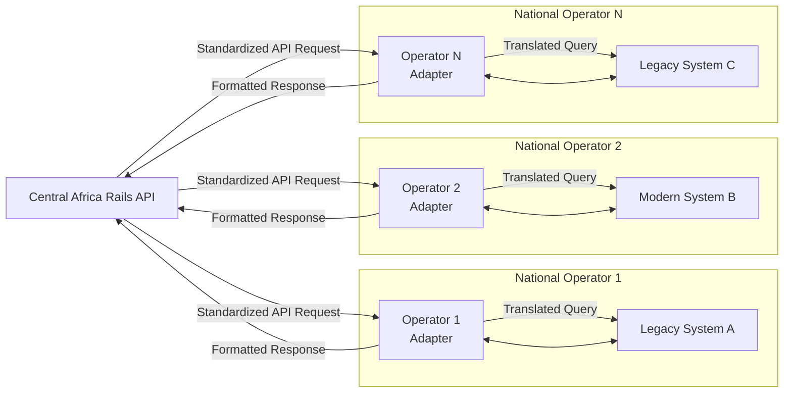

# Technical Architecture

This document provides technical details on the Africa Railways platform architecture, backend integration, and data flow between components.

## System Overview

```
┌─────────────────────────────────────────────────────────────────────────────┐
│                           AFRICA RAILWAYS PLATFORM                          │
├─────────────────────────────────────────────────────────────────────────────┤
│                                                                             │
│  ┌─────────────┐    ┌─────────────┐    ┌─────────────┐    ┌─────────────┐  │
│  │  Sentinel   │    │  Passenger  │    │    OCC      │    │   USSD      │  │
│  │  Mobile App │    │  Mobile App │    │  Dashboard  │    │  Gateway    │  │
│  └──────┬──────┘    └──────┬──────┘    └──────┬──────┘    └──────┬──────┘  │
│         │                  │                  │                  │         │
│         └──────────────────┼──────────────────┼──────────────────┘         │
│                            │                  │                            │
│                            ▼                  ▼                            │
│                    ┌───────────────────────────────┐                       │
│                    │      Go Backend API           │                       │
│                    │   (Ingest Engine + REST)      │                       │
│                    └───────────────┬───────────────┘                       │
│                                    │                                       │
│              ┌─────────────────────┼─────────────────────┐                 │
│              │                     │                     │                 │
│              ▼                     ▼                     ▼                 │
│      ┌───────────────┐    ┌───────────────┐    ┌───────────────┐          │
│      │   Sui Chain   │    │ Polygon Chain │    │   Firebase    │          │
│      │  (AFC Token)  │    │ (SENT Token)  │    │  (Real-time)  │          │
│      │  (Tickets)    │    │ (NFT Tickets) │    │  (Auth/Data)  │          │
│      └───────────────┘    └───────────────┘    └───────────────┘          │
│                                                                             │
└─────────────────────────────────────────────────────────────────────────────┘
```

## Continental Integration Roadmap

A legitimate continental railway integration requires a phased, multi-year approach involving governments, rail corporations, and engineering firms.

### Phase 1: Standardization & Diplomacy (Years 1-3+)

**Objective:** Establish governance and technical standards

**Actions:**
- Form consortium with African Union, UNECA, and national rail operators
- Define common data standard (e.g., RailML for Africa)
- Negotiate data sharing agreements and liability frameworks

**Deliverables:**
- Signed multilateral agreement
- Technical specification document (500+ pages)
- Governance framework and dispute resolution process

**Current Status:** Africa Railways is engaging with TAZARA and ZRL as pilot operators. Full continental standardization requires AU-level coordination.

### Phase 2: Federated API Gateway

The goal is not a single database but a secure gateway that translates requests between a central system and each operator's unique backend.



### Phase 3: Building Operator Adapters

Each adapter requires a dedicated team familiar with that operator's technology. A continental system would need 50+ adapters, each a significant software project.

**Example: Legacy SOAP Adapter (Python)**

```python
# Adapter for a hypothetical operator's legacy SOAP API
import zeep
from africa_rails_standard import TrainPosition, StandardAlert

class ZambiaRailwaysLegacyAdapter:
    def __init__(self, wsdl_url, api_key):
        # Connect to the operator's specific SOAP service
        self.client = zeep.Client(wsdl=wsdl_url)
        self.api_key = api_key

    def get_live_positions(self) -> list[TrainPosition]:
        """Fetches data and converts to continental standard."""
        try:
            # 1. CALL OPERATOR'S PROPRIETARY API
            raw_data = self.client.service.getTrainLocations(authKey=self.api_key)

            # 2. MAP to Continental Standard
            standard_positions = []
            for train in raw_data:
                std_position = TrainPosition(
                    train_id=f"ZM-{train.engineNumber}",
                    gps_lat=train.latitude,
                    gps_lon=train.longitude,
                    speed_kmh=train.speed,
                    timestamp=train.lastUpdated,
                    # ... converting 20+ other fields ...
                )
                standard_positions.append(std_position)

            return standard_positions

        except Exception as e:
            # Log and forward alert in standard format
            raise StandardAlert(
                code="ADAPTER_FAILURE_ZM",
                severity="HIGH",
                message=f"Zambia adapter failed: {str(e)}",
                operator="Zambia Railways Ltd."
            )
```

### Current Implementation Status

| Component | Status | Notes |
|-----------|--------|-------|
| Central API Gateway | ✅ Implemented | `/backend/operators/` |
| TAZARA Adapter | ✅ Pilot | Live on Mukuba Service |
| ZRL Adapter | 🔄 In Progress | EU Programme integration |
| TRC Adapter | 📋 Planned | Pending agreement |
| Other Operators | 📋 Future | Requires AU coordination |

**Honest Assessment:** Full continental integration requires:
- 50+ operator adapters (each a major project)
- Central gateway with security, monitoring, governance
- Multi-year diplomatic and technical coordination
- Significant funding ($10M+ for software alone)

Africa Railways is currently focused on the SADC corridor (TAZARA, ZRL) as proof of concept before broader expansion.

---

## Multi-Operator Integration Architecture

### Operator Adapters

Each national railway operator has a dedicated adapter that:
1. Translates standardized API requests to operator-specific formats
2. Handles authentication with legacy systems (SOAP, mainframe, etc.)
3. Normalizes responses to the common Africa Rails schema
4. Manages connection pooling, retry logic, and circuit breakers

| Operator | Country | System Type | Adapter | Status |
|----------|---------|-------------|---------|--------|
| TAZARA | Tanzania/Zambia | Legacy mainframe | `tazara_adapter.go` | ✅ Live |
| ZRL | Zambia | Mixed legacy/SOAP | `zrl_adapter.py` | 🔄 Pilot |
| TRC | Tanzania | Legacy | `trc_adapter.go` | 📋 Planned |
| KRC | Kenya | Modern REST API | `krc_adapter.go` | 📋 Planned |
| Transnet | South Africa | Enterprise SAP | `transnet_adapter.go` | 📋 Future |

### Standardized API Schema

All operators expose the same interface through the Central API:

```go
// OperatorAdapter interface - implemented by each national operator
type OperatorAdapter interface {
    // Metadata
    GetOperatorInfo() OperatorInfo
    
    // Station and route information
    GetStations(ctx context.Context) ([]Station, error)
    GetRoutes(ctx context.Context) ([]Route, error)
    GetSchedule(ctx context.Context, routeID string, date time.Time) ([]Schedule, error)
    
    // Real-time data
    GetTrainPositions(ctx context.Context) ([]TrainPosition, error)
    GetDelays(ctx context.Context) ([]DelayInfo, error)
    
    // Booking operations
    CheckAvailability(ctx context.Context, route string, date time.Time) ([]Seat, error)
    CreateBooking(ctx context.Context, booking *BookingRequest) (*Booking, error)
    CancelBooking(ctx context.Context, bookingID string) error
    
    // Telemetry (optional)
    SupportsTelemetry() bool
    SubscribeTelemetry(ctx context.Context) (<-chan TelemetryMessage, error)
    
    // Health
    HealthCheck(ctx context.Context) error
}
```

---

## Backend Components

### Go Ingest Engine (`/backend`)

The Go backend serves as the central data processing layer:

| File | Purpose |
|------|---------|
| `main.go` | WebSocket server for real-time dashboard updates |
| `telemetry/engine.go` | **GPS Ingest Engine** - Real-time locomotive telemetry processing |
| `telemetry/api.go` | **Telemetry API** - HTTP/WebSocket endpoints for GPS data |
| `sentinel_api.go` | Sentinel worker alert and report endpoints |
| `bookings_api.go` | Ticket booking and validation |
| `stations_api.go` | Station data and schedules |
| `operators_api.go` | Railway operator integration |
| `afc_payment.go` | AFC token payment processing |
| `wallet_keys.go` | Secure wallet key management |
| `sms_service.go` | SMS/WhatsApp OTP delivery |
| `whatsapp_otp.go` | WhatsApp Business API integration |

### GPS Telemetry Ingest Engine (`/backend/telemetry`)

The telemetry package provides real-time GPS processing for locomotives and track workers:

```go
// TelemetryMessage - Incoming GPS data from locomotives
type TelemetryMessage struct {
    DeviceID    string    `json:"device_id"`
    DeviceType  string    `json:"device_type"` // "locomotive", "worker", "sensor"
    TrainID     string    `json:"train_id"`
    Latitude    float64   `json:"latitude"`
    Longitude   float64   `json:"longitude"`
    Speed       float64   `json:"speed"`       // km/h
    Heading     float64   `json:"heading"`     // degrees from north
    Status      string    `json:"status"`      // "moving", "stopped", "idle"
    Timestamp   time.Time `json:"timestamp"`
}

// TrainPosition - Current train state with ETA calculation
type TrainPosition struct {
    TrainID      string    `json:"train_id"`
    Latitude     float64   `json:"latitude"`
    Longitude    float64   `json:"longitude"`
    Speed        float64   `json:"speed"`
    NextStation  string    `json:"next_station"`
    ETA          time.Time `json:"eta"`
    DelayMinutes int       `json:"delay_minutes"`
}
```

**Telemetry API Endpoints:**
```
POST /api/v1/telemetry           - Ingest GPS data from locomotive
GET  /api/v1/telemetry/positions - Get all current train positions
GET  /api/v1/telemetry/positions/{trainID} - Get specific train position
GET  /api/v1/telemetry/routes    - Get all railway routes
GET  /api/v1/telemetry/stations  - Get all stations with coordinates
WS   /api/v1/telemetry/ws        - Real-time position updates via WebSocket
```

**Features:**
- Sub-second latency for GPS updates
- Haversine distance calculation for ETA
- WebSocket streaming to OCC dashboard
- Pre-loaded TAZARA and ZRL route/station data
- API key authentication for locomotive devices

### API Endpoints

**Sentinel API** (`/api/sentinel/`)
```
POST /api/sentinel/alert      - Submit safety alert with GPS coordinates
POST /api/sentinel/report     - Submit shift/inspection report
POST /api/sentinel/location   - Update worker location (GPS ping)
GET  /api/sentinel/status     - Get worker status and shift info
GET  /api/sentinel/alerts     - List alerts for route/region
```

**Booking API** (`/api/bookings/`)
```
POST /api/bookings/create     - Create new ticket booking
GET  /api/bookings/:id        - Get booking details
POST /api/bookings/verify     - Verify ticket at gate (Polygon NFT check)
GET  /api/bookings/passenger  - Get passenger's tickets
```

**Stations API** (`/api/stations/`)
```
GET  /api/stations            - List all stations
GET  /api/stations/:id        - Get station details
GET  /api/stations/routes     - Get available routes
GET  /api/stations/schedule   - Get train schedules
```

### Data Flow: Sentinel Safety Report

```
1. Track Worker opens Sentinel Mobile App
   │
2. Worker submits safety report with:
   ├── GPS coordinates (latitude/longitude)
   ├── Report type (inspection, incident, shift_start/end)
   ├── Photos (optional)
   └── Notes
   │
3. Mobile App → POST /api/sentinel/report
   │
4. Go Backend:
   ├── Validates worker identity (zkLogin JWT)
   ├── Stores report in Firebase
   ├── Broadcasts to OCC Dashboard (WebSocket)
   └── Triggers $SENT reward calculation
   │
5. Sui Blockchain:
   ├── Records report hash for immutability
   └── Mints $SENT reward to worker wallet
   │
6. OCC Dashboard receives real-time update
```

### Data Flow: Ticket Purchase

```
1. Passenger initiates purchase via:
   ├── Mobile App (zkLogin)
   ├── Website (wallet connect)
   └── USSD (*384*26621#)
   │
2. Backend creates booking record
   │
3. Payment processed:
   ├── AFC token (Sui) - instant settlement
   ├── Mobile Money (MTN/Airtel) - via payment gateway
   └── Card (Stripe) - standard processing
   │
4. NFT Ticket minted on Polygon:
   ├── Metadata: route, seat, date, passenger
   ├── Gasless minting via Alchemy Gas Policy
   └── Ownership = legal ticket
   │
5. Event emitted on Sui for dashboard update
   │
6. Passenger receives:
   ├── QR code (contains ticket ID + wallet address)
   ├── SMS confirmation
   └── NFT in wallet
```

## Blockchain Architecture

### Dual-Chain Design

| Chain | Purpose | Token | Use Case |
|-------|---------|-------|----------|
| **Sui** | Fast settlement | $AFC | Payments, real-time events |
| **Polygon** | Source of truth | $SENT | NFT tickets, governance, staking |

### Why Two Chains?

1. **Sui for Speed**: Sub-second finality for payment confirmation
2. **Polygon for Ownership**: NFT represents legal ticket ownership
3. **Verification**: Gate scanning always checks Polygon (source of truth)
4. **Events**: Sui events trigger dashboard updates (fast notification)

### Smart Contracts

**Sui Move Contracts** (`/move/africoin/sources/`)
```move
// africoin.move - AFC payment token
module africoin::afc {
    struct AFC has drop {}
    public fun mint(treasury: &mut Treasury, amount: u64, ctx: &mut TxContext): Coin<AFC>
    public fun burn(treasury: &mut Treasury, coin: Coin<AFC>)
}

// ticket.move - Event emission for dashboard
module africoin::ticket {
    struct TicketMinted has copy, drop {
        ticket_id: String,
        passenger: address,
        route: String,
        timestamp: u64
    }
}
```

**Polygon Contracts** (`/contracts/`)
```solidity
// AfricaRailwaysTicket.sol - NFT Ticket (ERC-721)
contract AfricaRailwaysTicket is ERC721, Ownable {
    function mintTicket(address to, string memory tokenURI) external;
    function verifyOwnership(uint256 tokenId, address passenger) external view returns (bool);
}

// SENTStaking.sol - Staking with revenue share
contract SENTStaking {
    function stake(uint256 amount) external;
    function claimRewards() external;
    function getStakerInfo(address staker) external view returns (StakerInfo memory);
}

// SENTGovernance.sol - On-chain voting
contract SENTGovernance {
    function propose(string memory description, bytes memory callData) external returns (uint256);
    function vote(uint256 proposalId, bool support) external;
    function execute(uint256 proposalId) external;
}
```

## Authentication

### zkLogin Integration

Workers and passengers authenticate using zkLogin (Sui):

```
1. User clicks "Login with Google/Facebook"
2. OAuth provider returns JWT
3. zkLogin generates ephemeral keypair
4. Zero-knowledge proof created (no private key exposure)
5. User gets Sui wallet address derived from OAuth identity
6. Same identity = same wallet address (deterministic)
```

Benefits:
- No seed phrases to manage
- Familiar OAuth flow
- Wallet recovery via OAuth provider
- Works with USSD (phone number as identity)

## Real-Time Communication

### WebSocket Architecture

```go
// main.go - WebSocket handler
func wsHandler(w http.ResponseWriter, r *http.Request) {
    conn, _ := upgrader.Upgrade(w, r, nil)
    defer conn.Close()
    
    for {
        stats.mu.Lock()
        payload, _ := json.Marshal(stats)
        stats.mu.Unlock()
        
        conn.WriteMessage(websocket.TextMessage, payload)
        time.Sleep(2 * time.Second)
    }
}
```

Connected clients:
- OCC Dashboard (Operations Control Center)
- Sentinel Dashboard (worker management)
- Live Feed page (public ticket activity)

## Infrastructure

### Deployment

| Component | Platform | URL |
|-----------|----------|-----|
| Website | Vercel | africarailways.com |
| Backend API | Railway.app | api.africarailways.com |
| Mobile Apps | EAS (Expo) | App Store / Play Store |
| USSD Gateway | Africa's Talking | *384*26621# |

### Environment Variables

```bash
# Blockchain
SUI_RPC_URL=https://fullnode.mainnet.sui.io
POLYGON_RPC_URL=https://polygon-mainnet.g.alchemy.com/v2/...
ALCHEMY_API_KEY=...

# Authentication
GOOGLE_CLIENT_ID=...
FACEBOOK_APP_ID=...

# Services
FIREBASE_PROJECT_ID=africa-railways
TWILIO_ACCOUNT_SID=...
AFRICAS_TALKING_API_KEY=...
```

## Security

### Key Management

- Treasury keys: Gnosis Safe multi-sig (3-of-5)
- Relayer keys: GCP Secret Manager
- User keys: zkLogin (no private key storage)

### API Security

- Rate limiting: 100 requests/minute per IP
- Authentication: JWT tokens (Firebase Auth)
- CORS: Whitelist of allowed origins
- Input validation: All endpoints validate input

## Monitoring

### Metrics Collected

- Ticket sales volume (daily/weekly/monthly)
- Sentinel reports submitted
- Active workers online
- API response times
- Blockchain transaction success rate

### Alerting

- Relayer balance low (< 0.1 POL)
- API error rate > 5%
- WebSocket disconnections
- Failed ticket mints

## MVP: Africoin Wallet Exchange

The Africoin Wallet MVP is a separate repository demonstrating the complete user-facing application:

**Repository:** [github.com/mpolobe/scroll-waitlist-exchange-1](https://github.com/mpolobe/scroll-waitlist-exchange-1)

**Live Demo:** [scroll-waitlist-exchange-1-nnjr.vercel.app](https://scroll-waitlist-exchange-1-nnjr.vercel.app/)

### MVP Features

| Feature | Description |
|---------|-------------|
| **Digital Wallet** | Secure cryptocurrency wallet powered by Alchemy Account Kit |
| **Railway Booking** | Book train tickets across African railway networks |
| **Loyalty Program** | Earn and redeem points with tiered benefits |
| **Multi-Currency** | Handle transactions in multiple currencies |
| **Mobile Apps** | Native iOS and Android apps via Capacitor |
| **AI Assistant** | Integrated Gemini AI chatbot for customer support |
| **Admin Dashboard** | Comprehensive management interface |
| **Merchant Portal** | API integration for third-party merchants |

### MVP Tech Stack

**Frontend:**
- React 18 + TypeScript
- Vite (build tool)
- Tailwind CSS + shadcn/ui
- React Router

**Backend & Services:**
- Supabase (database + auth)
- Alchemy Account Kit (blockchain wallet)
- WalletConnect (Web3 connectivity)
- Sui Blockchain (zkLogin)
- Google Gemini AI (chatbot)

**Mobile:**
- Capacitor (cross-platform)
- Android & iOS native support

### MVP Project Structure

```
src/
├── components/
│   ├── admin/      # Admin dashboard
│   ├── auth/       # Authentication
│   ├── booking/    # Railway booking
│   ├── wallet/     # Wallet components
│   └── ui/         # Reusable UI
├── contexts/       # React contexts
├── hooks/          # Custom hooks
├── lib/            # Utilities
├── pages/          # Route pages
└── services/       # API services
```

### Running the MVP

```bash
# Clone MVP repository
git clone https://github.com/mpolobe/scroll-waitlist-exchange-1.git
cd scroll-waitlist-exchange-1

# Install dependencies
npm install

# Set up environment
cp .env.example .env
# Edit .env with your credentials

# Start development server
npm run dev
# Visit http://localhost:8080
```

### MVP Mobile Build

```bash
# Android
npm run build
npx cap sync android
npx cap open android

# iOS
npm run build
npx cap sync ios
npx cap open ios
```

---

## Development

### Local Setup

```bash
# Clone repository
git clone https://github.com/mpolobe/africa-railways.git
cd africa-railways

# Install dependencies
npm install
cd backend && go mod download

# Copy environment
cp .env.example .env

# Run backend
cd backend && go run .

# Run frontend
npm run dev
```

### Testing

```bash
# Backend tests
cd backend && go test ./...

# Frontend tests
npm test

# E2E tests
npm run test:e2e
```

## API Documentation

Full API documentation available at:
- OpenAPI Spec: `/api/v1/openapi.yaml`
- Stations API: `/docs/STATIONS_API.md`
- Operators API: `/docs/OPERATORS_API.md`
- Payment Integration: `/docs/PAYMENT_INTEGRATION_SPECS.md`

---

**Last Updated:** January 2026
